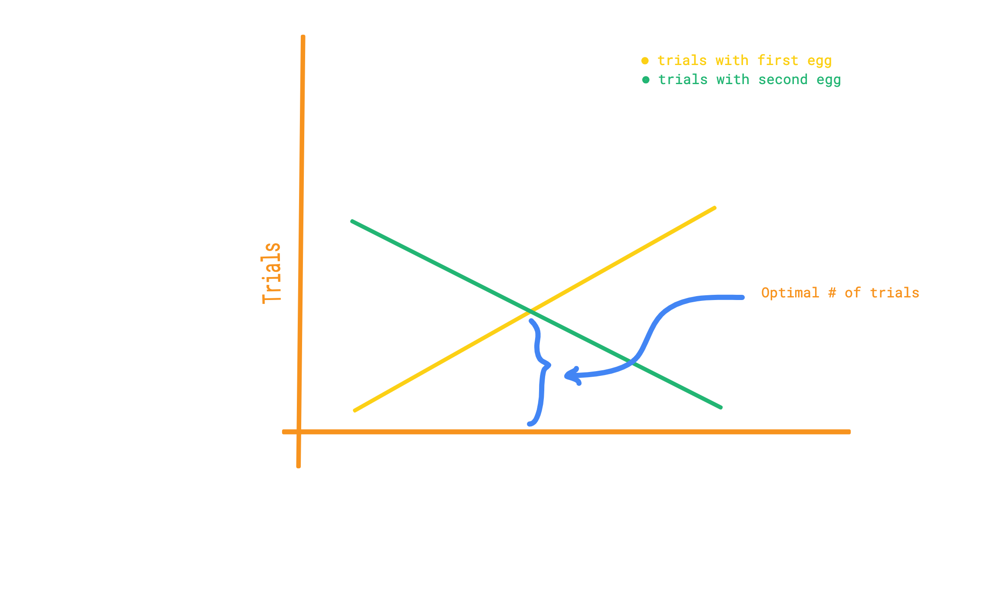

Although I do enjoy digging my feet into newer tricks and techniques when competiting, I really like problems that test your understanding of an algorithm or data structure at a deeper level.

During my days working as a software engineer, we'd often take coffee breaks which would eventually lead to discussing a fun new problem someone recently solved or took a shot at. This is eggsactly such a problem that a colleague was asked once at Google's interview.

The problem statement is as simple as it gets. You're given two identical eggs and a building with 100 floors. Your job is to figure out what is the highest floor from which you can drop the egg without breaking it. Since you're short on time, you have to find the smallest number of trials needed to figure this out. Of course it goes without saying that once you break one of the eggs you can no longer use it again in a trial. And if you break both before finding the optimal number of trials


So how do we do this. In interviews it's just as much about your thought process as it is about the actual solution itself. So let's take a structured approach to figuring this out. The naive method would be to simply keep dropping an egg starting from the first floor and then from every successive floor until it breaks. The answer to the problem is then `n-1` trials where `n` is the lowest floor from which a free fall would bring humpty dumpty to his demise. 

In the worst case this would require us to use 100 trials. Since that's the total number of floors we are not really optimizing anything! A key giveaway to keep in mind when trying to pick apart a problem statement is there is almost never any redundant information. The fact that we were given an extra egg must provide some sort of advantage that would help reduce the number of trials needed.

If you're experienced with sorting and searching problems then you might have picked up that since the floors are ordered, we can probably use something like binary search to reduce the complexity from `O(n)` to `O(log(n))`. 

Binary search helps us reduce the range of searching to half the parent range with every iteration until we narrow down on our target. So using binary search, a smart approach could be to drop the first egg from the middle floor (50th). If the egg breaks, then it's logical to believe that it will definitely break from all of the floors above it. So the answer lies somewhere from the first to the 49th floor. We've already destroyed one of our eggs. So now we can use the second egg to make trials with linear complexity by dropping it from the first all the way to the 49th floor. Similar to the worst case approach, if the egg breaks in the `n`-th trial, then we have our answer at `n-1`. If the first egg didn't break, then we know that it definitely wouldn't break in any of the floors below. So our range of interest now becomes from the 51st to the 100th floor. We keep shortening the range until the first egg breaks. Doing this would result in a worst case solution of 50. Which is half of our previous worst cast solution. A simple code for this is given below. 

```c++
#include<bits/stdc++.h>
#define MAX_FLOORS 100

bool didBreak(int floor);

using namespace std;

typedef struct searchRange {
    int low;
    int high;
} Range;

Range binSearch(int low, int high) {
    int mid = (low + high)/2;
    if(didBreak(mid)) {
        Range r;
        r.low = low;
        r.high = mid-1;
        return r;
    }
    binSearch(mid+1, high);
}


int main(int argc, char **argv) {
    ios_base::sync_with_stdio(false);

    // trials with first egg
    Range searchIn = binSearch(0,100);

    // trials with second egg
    for(int i = searchIn.low; i <= searchIn.high; i++)
    {
        if(didBreak(i))
        {
            cout << i-1 << endl;
            break;
        }
    }

    return 0;
}
```

By using the first egg to cut the range in half we've managed to make the second search much shorter. Not bad, but can we do better? This is where you put your insticts to good use and try to go back to the first principles of a logarithmic search. What other strategy could we adopt to shorten the range that would yield the greatest savings? Let's explore a few such ranges.

What happens if we drop the first egg from the 10th floor. If it breaks, then we only have to search the first 9 floors bringing our required trials to just 19. If the egg doesn't break, then we can try 10 floors above that from the 20th. At whichever trial the egg breaks, we only have to search 9 floors- starting from the floor of the last trial where the egg survived to the next where it broke. Doing this the maximum number of trials we would need for the first egg would be 10, since we're dropping from the 10th all the way to the 100th in increments of 10. 


For the second egg the number of drops is always going to be 9. Because just as for the case of halving we reduce the search space for the second egg to be `100/2-1 = 49` floors, in the case of dividing the range in 10, the maximum number of trials with the second egg turns out to be `100/10-1 = 9`. We can now formulate the number of trials to find the answer in terms of the number of floors `num_floors`, the number of trials needed with the first egg `t1` and the number of trials needed with the second egg `t2` as `t1 + num_floors/t1 - 1`. This term is the sum of the trials needed using the first and second egg.

For the first egg, worst case # of trials needed: `t1`

For the second egg, worst case # of trials needed given we know `t1`: `num_floors/t1 - 1`.

Look closely, the more `t1` seems to increase, i.e the more number of trials we are willing to do with the first egg (by dividing the range into smaller portions), the larger smaller the value for the number of trials needed with the second egg becomes. 



The diagram above clearly shows how these two variables are inversely correlated. There's an optimal point where we find a number `t1` for which the total number of trials is minimized. 

Instead of dropping the first egg in equal intervals, we can take a staggered interval that is reduced in successive trials. We want to make it such that the the difference between successive trials gradually decreases to 1 as we reach the top floor. If the very first drop we make is from floor #14, and it breaks, then use the second egg and drop it from floors #1-#13 making our total number of trials in the worst case to be 14 (1 with the first egg and 13 with the second). If the first egg does not break at floor #14, instead of dropping it at an equal interval of 14 from floor #28, we drop it from floor #27, using the idea of successively decreasing intervals. This makes our number of trials using the first egg to be 2 (first from #14 and second from #27). But if the egg breaks from this floor, notice how our range for the second egg is now only 12 (from the 15th to the 26th floor). Summing these two values we get the worst case number of trials needed for both the eggs combined to be 14, just as before. By reducing the range for the second egg every time we need an additional trial with the first egg, we are compensating for increasing values of `t1` and keeping the total number of trials constant at 14. 

It can be proven using induction that this is the optimal strategy and that the optimal answer for 100 floors is indeed 14. But how did we come up with 14? Try the same problem for a buidling with only 50 floors. The proof is left as an exercise because I need to make breakfast now. Sunny side up! 🍳🍳


