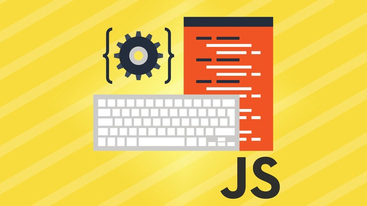

One of the best ways to learn a new programming language is to ask yourself two important questions-

1. What makes this language different?
2. What do I need it for?

Probably the first thing that comes to mind when talking about JavaScript as a programming language is its event-driven architecture. Simply put, this means that even after the script has run, the code lives in memory allowing it to respond to events. And this ability of jumping to a specific function in the script makes it seem like it’s executing hundreds of lines of code blazing fast. This makes it the perfect choice for developing event-driven real time applications as is the case with NodeJs. This is something that makes JavaScript **Awesome** but also _Weird_... here’s why.  

Consider the following event handler that responds to a click

```js
var count = 0;
var button = document.getElementById('button');
button.addEventListener('click', function() {
  count++;
  alert(count);
});
```

All this does is increment a global counter variable every time a button is clicked. Simple enough. Even after the script has run, the function can be called in response to an event and it has access to the global variable because it exists in memory. But it’s always good practice to use local variables whenever possible. So let’s look at how that could be.

```js
var button = document.getElementById('button');
button.addEventListener('click', function() {
  var count = 0;
  count++;
  alert(count);
});
```
But this won’t work, because obviously the local variable inside the function will always be reset to 0 every time the event fires. So we need to approach this a little differently.  
\
### “First-class functions are just like primitives and objects” 

In JavaScript functions are treated as [_first-class-citizens_](https://en.wikipedia.org/wiki/First-class_citizen). What this basically means is that just like primitive values and objects, functions can be

- Assigned to variables
- Returned from functions
- Passed as arguments to functions

This helps us solve our problem by returning a
function from a function that will have access to a variable from it’s parent function. This might start to sound like a script from the movie Inception, but it’s simple once you wrap your head around it. Let’s look at what I mean

```js
var button = document.getElementById('button');
// First we create a function that has the local variable count inside it
var parentFunction = function() {
  var count = 0; // Local variable inside the function
// Now we define a child function inside this function that will increment the count variable
  var newFunc = function() {
    count++; // child function increments the parent's variable
    alert(count);
  }
  
  // Finally we return this child function when we execute the parent function
  return newFunc;
  
  
  
}
button.addEventListener('click', parentFunction()); // Invoking the parent function so it returns the child function as the argument to the event handler
```

The event handler in the code accepts an event as the first and a function as the second argument.

As the second argument, we pass the invocation of the parent function so essentially we pass in the child function it returns as the second argument to the event handler. It’s important to note that the parent function isn’t returning the execution of the child function. It’s returning a reference to the child function so it can be executed whenever deemed necessary to do so.

So the idea of first-class functions provide a lot of flexibility in the case of how we conventionally think about functions as return values vs an actual object with properties and behavior.

Now if you examine the code above, something seems a bit off. Once the parent function runs, and returns the new child function, we are essentially out of the execution context of the parent function and thus should not have access to its local variables. So after a function has run, trying to access any of its local variables should cause a null pointer exception or in JavaScript terms, the value of undefined. So how is it, that the child function can increment the parent’s counter variable as if it’s a global variable? That’s where closures come in.

### “A closure is a function plus its immediate environment or lexical scope”

Contrary to the scoping rules imposed on functions in many of the other languages, JavaScript functions have lexical scope. Meaning that regardless of the execution context of a function, it’s scope will always be the scope defined in the way the script is written. The word lexical basically means what you can see. So in code, the variables you can see a function have access to by the way it’s written, is the variables it will have access to as part of its scope- regardless of the context in which it is run. These two concepts of first-class functions and closures are two of the three most confusing parts of JavaScript for someone coming from a language background like Java or C++. The third one is how the “this” keyword is bound to values. That deserves a separate writing of its own.

Despite the initial confusion surrounding closures, it can be a very effective tool for writing clever and efficient code, if used correctly.

I’ve written a pen for this topic for those interested-

